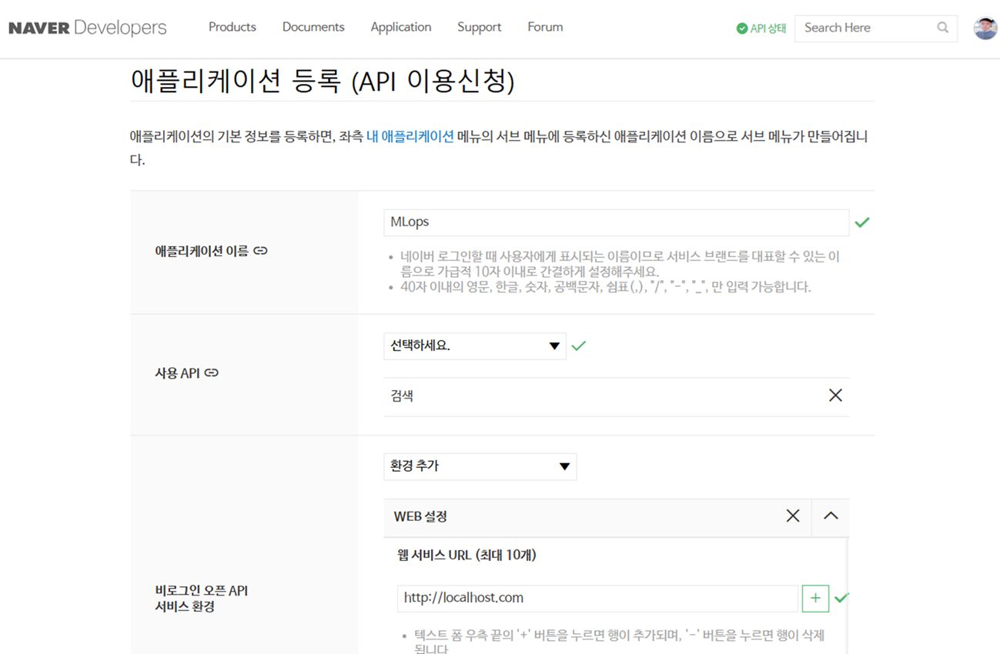
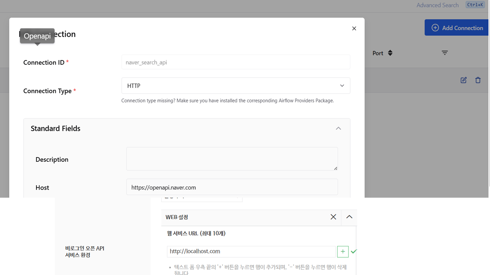
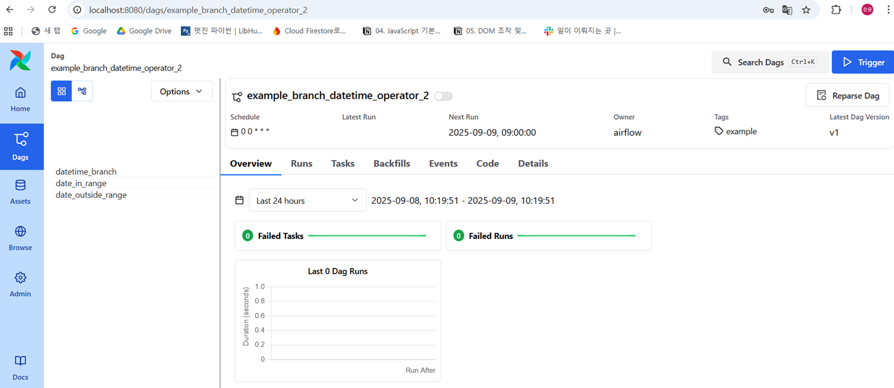
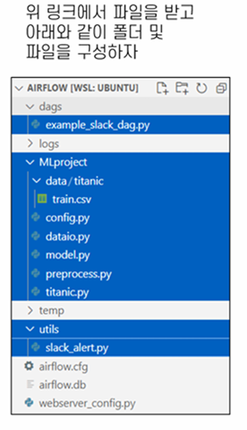

# 🌬️ Apache Airflow 실습/운영 통합 가이드

이 디렉토리는 Apache Airflow의 실제 배포 및 데이터 파이프라인 실습 과정을 각 단계별 이미지와 함께 기록/정리한 공간입니다.

## 1️⃣ 실습 목적
- ETL·머신러닝 등 워크플로우/파이프라인 자동화 운영 경험
- 네이버/외부 API 연동, DAG설정, 모듈화 등 실전 워크플로우 구현

## 2️⃣ 실습 주요 구성 & 이미지 안내

### 1. 앱 등록 & 연동 (API 발급)

- 네이버 오픈 API 등 연동을 위한 App 등록(MLops)
- 서비스 환경/웹 URL, 사용 API 입력(예: http://localhost.com)

### 2. OpenAPI 커넥션 연결

- Airflow Connection 메뉴에서 외부 API 연결
- Connection ID, HTTP 타입, Host, API 엔드포인트 정보 입력

### 3. Airflow DAG 동작·모니터링 화면

- WebUI에서 작업(DAG) 생성/스케줄/실행 현황 실시간 모니터링
- 개별 Task, Run 그래프 등 시각화 지원

### 4. 실습 예시 폴더/파일 구조

- dags/example_slack_dag.py: 예제 DAG
- MLproject/data/titanic/ 이하 ETL/모델/파이프라인 모듈 구조화
- utils/slack_alert.py: 슬랙 알림 코드 등

## 3️⃣ 실전 운영/개발 흐름
1. 외부 서비스(App) 등록 & API 연결정보 발급
2. Airflow WebUI에서 Connection 활성화 및 기존/신규 DAG 등록
3. 모듈화한 작업(py) 코드 작성, 폴더구조 설계(재현 가능!)
4. UI서 DAG 모니터링 및 각 Task 성공/실패/CRUD 모니터링

## 4️⃣ 참고 & 확장 가이드
- [Airflow 공식문서](https://airflow.apache.org/docs/)
- [네이버 오픈API 센터](https://developers.naver.com/main/)
- ETL, ML, Slack 알림 등 확장 시 폴더 구조·코드 재활용 권장

> 이미지는 실제 실습 환경을 캡처한 것으로, 운영 자동화/서비스 외부 연동 구성/실행 모니터링을 배우고 싶은 분께 적극 추천합니다!
