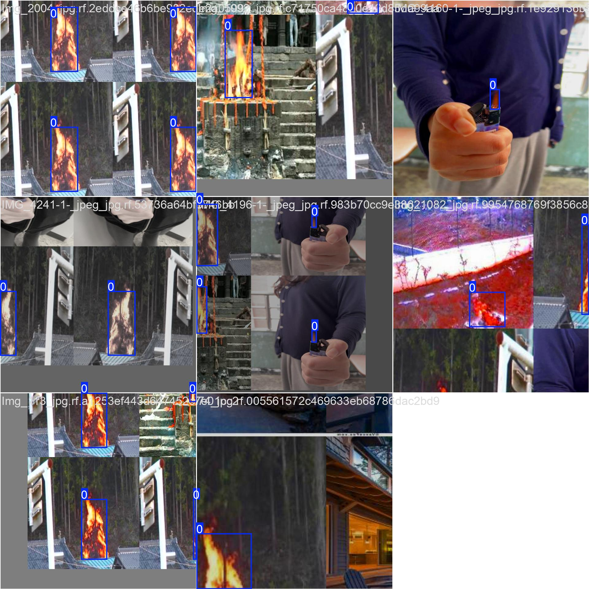
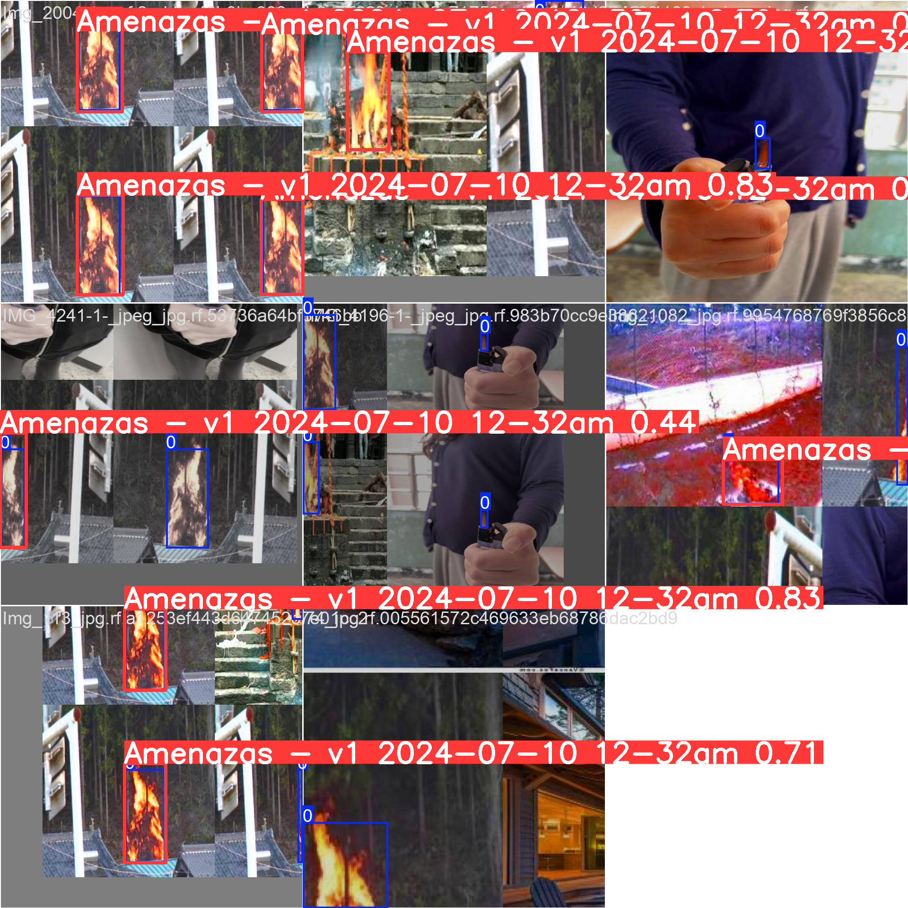

# 화재 탐지 YOLOv12 딥러닝 프로젝트

## 📋 프로젝트 개요

이 프로젝트는 YOLOv12 모델을 사용하여 실시간 화재 탐지를 수행하는 딥러닝 시스템입니다. Roboflow에서 제공하는 화재 데이터셋을 활용하여 모델을 학습시키고, SAHI(Slicing Aided Hyper Inference) 기법을 적용하여 작은 화재 객체의 탐지 성능을 향상시켰습니다.

## 🎯 주요 기능

- **실시간 화재 탐지**: YOLOv12 모델을 통한 고속 화재 감지
- **SAHI 적용**: 작은 화재 객체 탐지 성능 향상
- **Roboflow 데이터셋 활용**: 전문적인 화재 이미지 데이터셋 사용
- **GPU 가속**: CUDA를 활용한 빠른 학습 및 추론

## 🛠️ 기술 스택

- **딥러닝 프레임워크**: PyTorch
- **모델**: YOLOv12 (Ultralytics)
- **데이터셋**: Roboflow Fire Detection Dataset
- **추론 최적화**: SAHI (Slicing Aided Hyper Inference)
- **개발 환경**: Google Colab / Jupyter Notebook

## 📦 설치 및 환경 설정

### 필수 패키지 설치

```bash
# Roboflow 데이터셋 다운로드
pip install roboflow

# YOLOv12 모델 및 Ultralytics 설치
pip install ultralytics

# SAHI 설치 (작은 객체 탐지 강화)
pip install sahi==0.11.15

# NumPy 버전 호환성 (SAHI 요구사항)
pip install "numpy<2.0"
```

### 데이터셋 다운로드

```python
from roboflow import Roboflow

rf = Roboflow(api_key="YOUR_API_KEY")
project = rf.workspace("dia-tsxhd").project("fire-noucr")
version = project.version(1)
dataset = version.download("yolov12")
```

## 🚀 사용 방법

### 1. 모델 학습

```python
from ultralytics import YOLO

# YOLOv12 모델 로드
model = YOLO("yolo12s.pt")

# 화재 탐지 모델 학습
model.train(
    data="/path/to/fire-1/data.yaml",
    epochs=50,
    imgsz=640,
    batch=8,
    name="fire_yolov12"
)
```

### 2. SAHI를 활용한 추론

```python
from sahi.predict import get_sliced_prediction
from sahi.models.yolov8 import Yolov8DetectionModel

# 학습된 모델 로드
detection_model = Yolov8DetectionModel(
    model_path="/path/to/best.pt",
    confidence_threshold=0.3,
    device="cuda"
)

# SAHI 적용 예측
result = get_sliced_prediction(
    image="/path/to/image.jpg",
    detection_model=detection_model,
    slice_height=512,
    slice_width=512,
    overlap_height_ratio=0.2,
    overlap_width_ratio=0.2
)

# 결과 시각화 및 저장
result.export_visuals(export_dir="/path/to/results/")
```

## 📊 모델 성능

- **학습 에포크**: 50 epochs
- **이미지 크기**: 640x640
- **배치 크기**: 8
- **신뢰도 임계값**: 0.3
- **SAHI 슬라이스 크기**: 512x512
- **오버랩 비율**: 20%

## 📁 프로젝트 구조

```
화재_탐지_yolov12_딥러닝/
├── 화재_탐지_yolov12_딥러닝.ipynb    # 메인 노트북 파일
├── train_batch0.jpg                  # 학습 배치 샘플 이미지
├── prediction_visual.png             # 예측 결과 시각화
└── README.md                         # 프로젝트 문서
```

## 🔧 주요 설정

### 학습 하이퍼파라미터
- **Learning Rate**: 0.01
- **Momentum**: 0.937
- **Weight Decay**: 0.0005
- **IoU Threshold**: 0.7
- **Confidence Threshold**: 0.3

### SAHI 설정
- **Slice Size**: 512x512 pixels
- **Overlap Ratio**: 20%
- **Confidence Threshold**: 0.3

## 📈 결과 및 시각화

### 학습 배치 샘플 이미지
다음은 모델 학습 과정에서 사용된 배치 샘플 이미지입니다:



### SAHI 예측 결과
다음은 SAHI(Slicing Aided Hyper Inference) 기법을 적용한 화재 탐지 예측 결과입니다:



**주요 특징:**
- 작은 화재 객체 탐지 성능 향상
- 슬라이싱 기법을 통한 정확도 개선
- 실시간 화재 감지 가능

## 🔗 참고 자료

- [YOLOv12 공식 문서](https://docs.ultralytics.com/)
- [Ultralytics GitHub](https://github.com/ultralytics/ultralytics)
- [SAHI 공식 문서](https://github.com/obss/sahi)
- [Roboflow 플랫폼](https://roboflow.com/)
- [PyTorch 공식 문서](https://pytorch.org/docs/)
- [OpenCV 문서](https://docs.opencv.org/)

## 📝 라이선스

이 프로젝트는 교육 및 연구 목적으로 제작되었습니다. 상업적 사용 시 관련 라이선스를 확인하시기 바랍니다.

## 🤝 기여하기

프로젝트 개선을 위한 기여를 환영합니다. 이슈 리포트나 풀 리퀘스트를 통해 참여해주세요.

## 📞 문의

프로젝트에 대한 문의사항이 있으시면 이슈를 통해 연락해주세요.

---

**주의사항**: 이 모델은 실시간 화재 탐지를 위한 연구 목적으로 개발되었습니다. 실제 화재 안전 시스템에 적용하기 전에는 충분한 검증과 테스트가 필요합니다.
