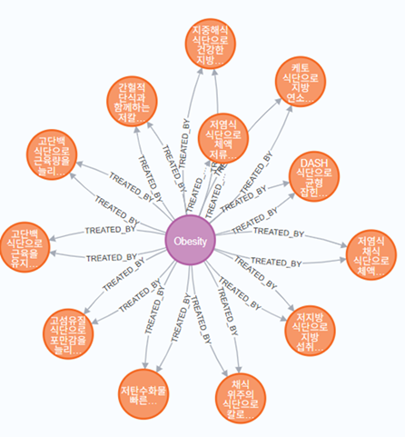
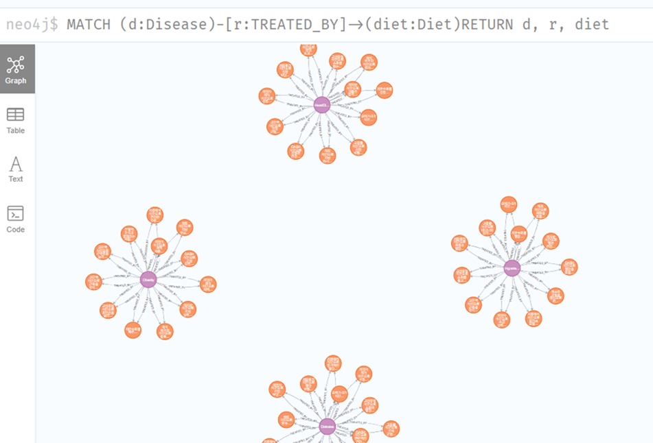
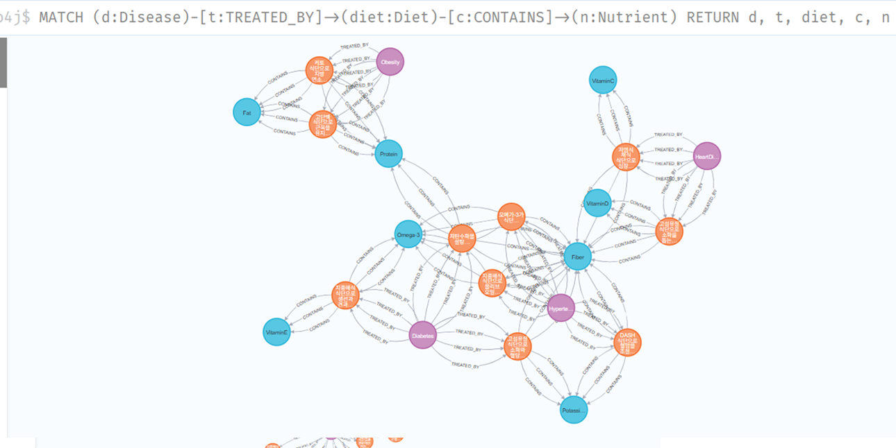

# GraphRAG 실습 프로젝트

이 프로젝트는 GraphRAG(Graph Retrieval-Augmented Generation) 기술을 활용하여 Neo4j 그래프 데이터베이스와 Ollama LLM을 연결한 실습 예제입니다.

## 📋 프로젝트 개요

GraphRAG는 그래프 데이터베이스의 구조화된 정보를 활용하여 더 정확하고 맥락적인 답변을 생성하는 RAG(Retrieval-Augmented Generation) 기술입니다. 이 실습에서는 질병과 식단 간의 관계를 그래프로 표현하고, 이를 통해 질문-답변 시스템을 구축합니다.

## 🏗️ 시스템 아키텍처



## 🔧 기술 스택

- **Neo4j**: 그래프 데이터베이스 (Neo4j Sandbox 사용)
- **Ollama**: 로컬 LLM 서버 (exaone3.5:2.4b 모델)
- **LangChain**: LLM 프레임워크 및 체인 구성
- **Python**: 개발 언어

## 📦 설치 및 설정

### 1. 필요한 패키지 설치

```bash
pip install colab-xterm
pip install langchain_ollama
pip install langchain_community
pip install neo4j
```

### 2. Ollama 설치 및 모델 다운로드

```bash
# Ollama 설치
curl -fsSL https://ollama.com/install.sh | sh

# Ollama 서버 시작
ollama serve &

# 필요한 모델 다운로드
ollama pull exaone3.5:2.4b &
ollama pull nomic-embed-text &
```

## 🗄️ 데이터베이스 스키마 (1홉 탐색)



### 노드 타입 (1홉 탐색)
- **Disease**: 질병 정보 (name 속성)
- **Diet**: 식단 정보 (description 속성)

### 관계 타입 (1홉 탐색)
- **TREATED_BY**: 질병과 식단 간의 치료 관계 (effectiveness 속성)

## 🚀 사용법

### 1. 기본 설정

```python
from langchain_ollama import ChatOllama
from langchain_community.graphs import Neo4jGraph
from langchain.chains import GraphCypherQAChain
from langchain.prompts import PromptTemplate

# Neo4j Sandbox 연결
graph = Neo4jGraph(
    url="bolt://98.80.136.12:7687",
    username="neo4j",
    password="schoolhouses-trunks-hole"
)

# Ollama LLM 설정
llm = ChatOllama(
    model="exaone3.5:2.4b",
    base_url="http://localhost:11434",
    temperature=0.7
)
```

### 2. 1홉 탐색 (1-hop Exploration)

1홉 탐색은 질병과 식단 간의 직접적인 관계를 탐색하는 방식입니다.

```python
# Cypher 쿼리 생성 프롬프트
CYPHER_GENERATION_TEMPLATE = """
당신은 Neo4j 그래프 데이터베이스에서 Cypher 쿼리를 생성하는 전문가입니다.
사용자의 질문에 따라 적절한 Cypher 쿼리를 작성하세요.
질문: {question}

그래프 스키마:
- 노드: Disease(name), Diet(description)
- 관계: TREATED_BY(effectiveness)

Cypher 쿼리만 반환하세요.
"""

cypher_prompt = PromptTemplate(
    input_variables=["question"],
    template=CYPHER_GENERATION_TEMPLATE
)

# GraphRAG 체인 생성
chain = GraphCypherQAChain.from_llm(
    llm=llm,
    graph=graph,
    cypher_prompt=cypher_prompt,
    verbose=True,
    allow_dangerous_requests=True
)
```

### 3. 질문 실행 예시

```python
def ask_question(query):
    response = chain.invoke({"query": query})
    return response["result"]

# 예시 질문들
questions = [
    "당뇨병에 효과적인 식단은 무엇인가요?",
    "고혈압을 치료하는 식단 중 효과 점수가 8 이상인 것은?",
    "지중해식 식단이 어떤 질병에 효과적인가요?"
]

for q in questions:
    print(f"\n질문: {q}")
    answer = ask_question(q)
    print(f"답변: {answer}")
```

### 4. 2홉 탐색 (2-hop Exploration)



2홉 탐색은 질병 → 식단 → 영양소와 같이 더 복잡한 관계를 탐색하는 방식입니다:

```python
# 2홉 탐색을 위한 프롬프트 템플릿
CYPHER_GENERATION_TEMPLATE = """
당신은 Neo4j 그래프 데이터베이스에서 Cypher 쿼리를 생성하는 전문가입니다.
사용자의 질문에 따라 적절한 Cypher 쿼리를 작성하세요. 2홉 경로도 고려하세요.
모든 변수를 `WITH` 절에서 명시적으로 전달하여 변수가 누락되지 않도록 하세요.
질문: {question}

그래프 스키마:
- 노드: Disease(name), Diet(description), Nutrient(name)
- 관계: TREATED_BY(effectiveness), CONTAINS(amount)

Cypher 쿼리만 반환하세요.
"""
```

## 🔍 주요 기능

1. **자동 Cypher 쿼리 생성**: 자연어 질문을 Cypher 쿼리로 변환
2. **그래프 기반 답변 생성**: 그래프 데이터를 활용한 맥락적 답변
3. **다중 홉 탐색**: 1홉, 2홉 등 다양한 깊이의 관계 탐색
4. **효과성 점수 기반 필터링**: 치료 효과 점수를 활용한 정확한 검색

## 📊 실행 결과 예시

### 질문: "당뇨병에 효과적인 식단은 무엇인가요?"

**생성된 Cypher 쿼리:**
```cypher
MATCH (d:Disease {name: 'Diabetes'})-[:TREATED_BY]->(di:Diet)
RETURN di.description AS EffectiveDietDescription
```

**답변:**
당뇨병 관리에 효과적인 식단으로는 **저탄수화물 식단**이 주목받고 있습니다. 이 식단은 설탕 섭취를 줄여 혈당 조절에 도움을 주며, **지중해식 식단** 또한 생선과 견과류를 포함하여 건강에 이로운 지방과 단백질을 제공해 당뇨병 환자에게 유익할 수 있습니다. **채식 위주의 식단**은 높은 섬유질 섭취로 혈당 안정에 도움이 되며, **케토 식단**은 탄수화물 섭취를 극단적으로 제한하여 혈당을 낮추는 데 효과적일 수 있습니다.

## ⚠️ 주의사항

1. **Neo4j Sandbox**: 이 실습은 Neo4j Sandbox를 사용하므로 연결 정보가 변경될 수 있습니다.
2. **모델 호환성**: Ollama 모델이 로컬에서 실행되어야 합니다.
3. **데이터 스키마**: 실제 데이터베이스의 스키마에 따라 쿼리 결과가 달라질 수 있습니다.

## 🛠️ 문제 해결

### 일반적인 오류들

1. **Neo4j 연결 오류**: Sandbox URL과 인증 정보 확인
2. **Ollama 모델 로드 실패**: 모델이 올바르게 다운로드되었는지 확인
3. **Cypher 쿼리 오류**: 그래프 스키마와 실제 데이터 구조 일치 여부 확인

## 📚 참고 자료

- [Neo4j 공식 문서](https://neo4j.com/docs/)
- [LangChain GraphRAG 가이드](https://python.langchain.com/docs/use_cases/graph/)
- [Ollama 공식 문서](https://ollama.ai/docs)

## 📄 라이선스

이 프로젝트는 교육 목적으로 제작되었습니다.

---

**실습 파일**: `Graph실습.ipynb`  
**작성일**: 2025년 10월월  
**목적**: GraphRAG 기술 학습 및 실습
